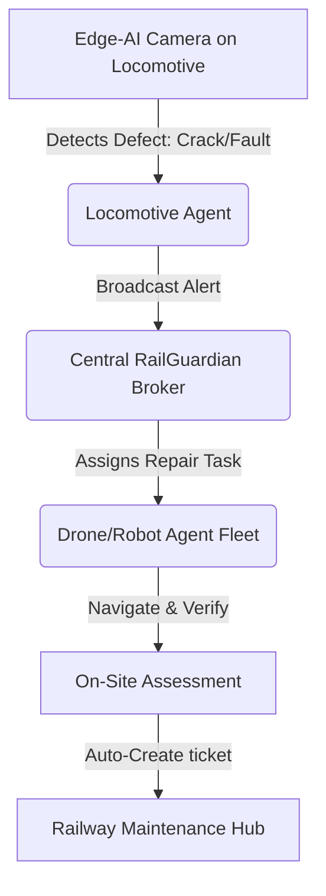
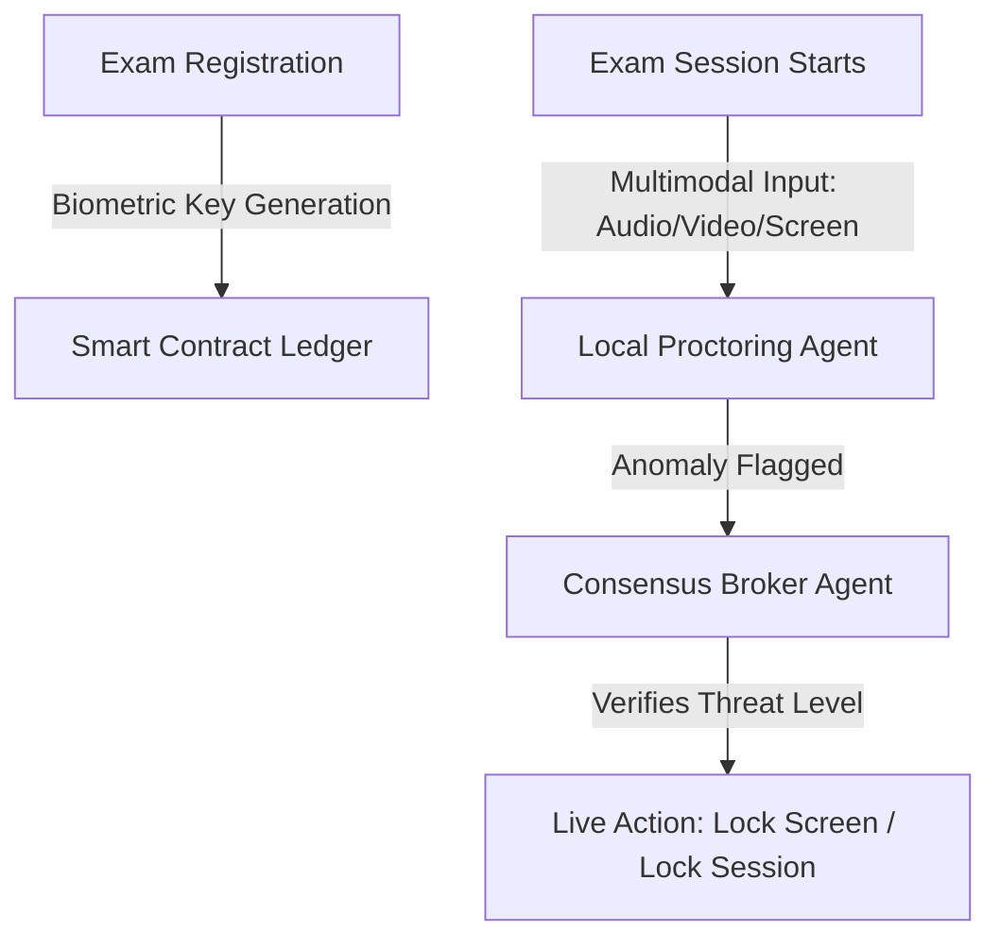
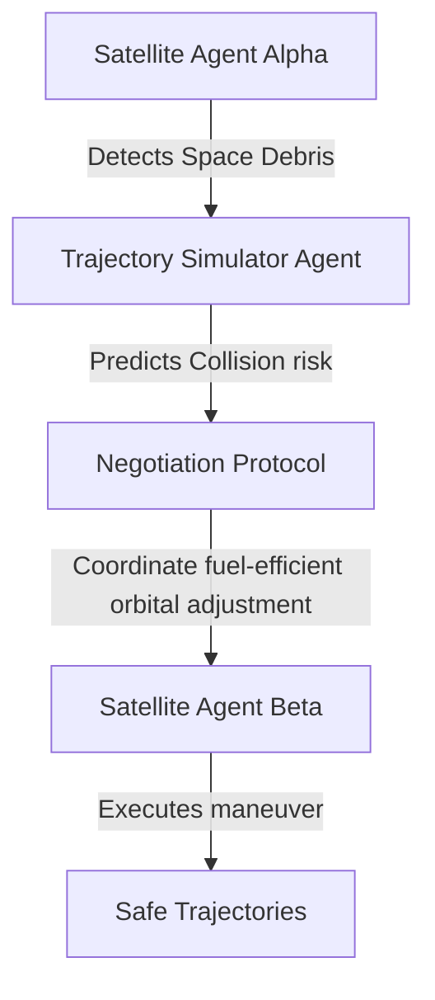
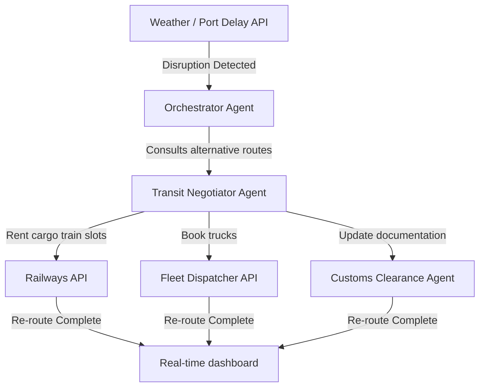

# High-Impact Hackathon Problem Statements
## Brainstorming & Proposals (Agentic & Autonomous Focus)

For a hackathon problem statement to be selected out of thousands, it must possess three core attributes:
1. **Critical Urgency**: Resolves a multi-billion dollar or life-critical problem.
2. **Technological Edge**: Employs cutting-edge paradigms (specifically **Multi-Agent Systems (MAS)**, **Edge AI**, or **Autonomous Orchestration**).
3. **Feasible MVP Scope**: Can be prototyped as a compelling demonstration within a 36-to-72-hour window.

The following proposal outlines five highly specialized, "ready-to-submit" problem statements. Each statement combines one of your target domains (Railways, Examinations, Space & Aerospace, Logistics & Transit) with an **Agentic & Autonomous System** architecture to deliver maximum impact.

---

## 1. Railways & Autonomous Systems
### **Problem Statement: RailGuardian AI – Autonomous Track Inspection & Real-time Maintenance Dispatch Swarm**

* **Domain Focus**: Railways + Agentic & Autonomous Systems
* **The Core Pain Point**: Railway track defects (fractures, misalignment, loose fishplates) cause catastrophic derailments, loss of life, and massive economic shutdowns. Current manual track inspections are slow, irregular, and highly prone to human error.
* **The Agentic Solution**: An autonomous, distributed multi-agent system consisting of:
  * **Inspection Agents**: Lightweight, Edge-AI visual processing models running on cameras mounted to regular passenger/cargo trains, scanning tracks in real-time.
  * **Coordinator Agent**: A central LLM-based coordinator that ingests defect coordinates, filters false positives, and automatically schedules maintenance.
  * **Repair Dispatcher Agents**: Autonomous robotic/drone agents that coordinate with railway scheduling APIs to find a safe "maintenance window" (between train runs) to dispatch local repair crews or robotic repair crawlers.
* **Why it stands out (The Winner Factor)**: It shifts rail maintenance from **reactive** (fixing after an accident/delay) to **proactive & autonomous** (zero-human intervention required from detection to scheduling). It uses real-world telemetry and scheduling data, demonstrating immediate economic ROI.
* **Hackathon MVP Scope**:
  * A computer vision model (YOLO-based) trained to detect simulated cracks/obstructions on a model railroad track.
  * An LLM agent using LangChain/AutoGen that acts as the "Dispatcher," reading train timetables (mock JSON API) to find scheduling gaps and auto-generating repair tickets.

---

## 2. Examinations & Agentic Systems
### **Problem Statement: CryptaProctor – Decentralized, Tamper-Proof Exam Delivery & Anti-Impersonation Agent Network**

* **Domain Focus**: Academic & Professional Examinations + Agentic Systems
* **The Core Pain Point**: High-stakes competitive examinations suffer from widespread question leaks, digital impersonation (proxy test-takers), and sophisticated cheating using hidden micro-devices. Human-based remote proctoring is expensive and has low accuracy, while static AI proctoring flags too many false positives (e.g., looking away for a second).
* **The Agentic Solution**: A multi-tiered agentic framework designed to secure examinations:
  * **Syllabus & Question Generator Agent**: Synthesizes unique, isomorphic exam variants on-the-fly using secure LLM models just minutes before the exam, making leaks useless.
  * **Multimodal Edge Proctoring Agent**: Monitors eye-tracking, ambient audio frequencies (detecting sub-vocal communication), and active application context.
  * **Mitigation Agent**: Rather than immediately failing a student, it initiates a real-time, AI-driven "integrity test" (dynamic pop-up questions based on the suspected cheat) to autonomously confirm if the user has external assistance.
* **Why it stands out (The Winner Factor)**: It addresses the massive global issue of exam security (relevant to boards like SAT, UPSC, GRE, and corporate certs). It introduces "Interactive Mitigation" rather than standard passive surveillance.
* **Hackathon MVP Scope**:
  * An electron/web-based secure exam window.
  * A web-cam monitor using MediaPipe (face mesh & gaze tracking) connected to a local AI agent.
  * When a violation occurs, the agent dynamically injects a verification question into the test interface.

---

## 3. Space, Aerospace & Autonomous Systems
### **Problem Statement: OrbitalShield – Peer-to-Peer Autonomous Collision Avoidance & Space Debris Coordination Swarm**

* **Domain Focus**: Space & Aerospace + Agentic & Autonomous Systems
* **The Core Pain Point**: Space debris (over 100 million active particles) threatens satellite constellations (e.g., Starlink, GPS). Orbit adjustments currently require manual calculation and ground control command authorization, which takes hours—far too slow when multiple debris paths overlap.
* **The Agentic Solution**: A decentralized, peer-to-peer satellite swarm agent system:
  * **Telemetry Analyst Agent**: Runs onboard satellites, continuously analyzing radar/LIDAR telemetry and predicting collision risks.
  * **Negotiator Agent**: When a collision risk with another satellite is detected, the two satellite agents autonomously negotiate a coordinated, fuel-optimal orbit adjustment plan using game theory (e.g., Nash Equilibrium).
  * **Actuation Agent**: Calculates thrust vectors, runs safety simulations, and executes the maneuver autonomously, reporting the results back to Earth.
* **Why it stands out (The Winner Factor)**: The "Mega-constellation" boom (Starlink, Kuiper) makes manual ground control impossible. An autonomous, decentralized swarm is the only viable future for space traffic management.
* **Hackathon MVP Scope**:
  * A 3D WebGL simulator (Three.js) showing orbital trajectories of satellites and space debris.
  * Agents running in the background communicating via WebSockets, detecting collisions, running the negotiation protocol, and visually adjusting the orbit on the screen in real-time.

---

## 4. Logistics, Transit & Autonomous Systems
### **Problem Statement: SynchroRoute – Autonomous Multi-Agent Logistics Corridor & Supply Chain Resiliency Engine**

* **Domain Focus**: Logistics & Transit + Agentic & Autonomous Systems
* **The Core Pain Point**: Global supply chains lose billions of dollars annually due to static planning. When a port is congested or a train is delayed, manually re-routing cargo across ships, rails, and trucks takes days of calling brokers, updating custom declarations, and re-booking, leading to spoilage and factory shutdowns.
* **The Agentic Solution**: A multi-agent network representing each node in the supply chain:
  * **Sensing Agent**: Monitors real-time transit telemetry (IoT trackers, port queues, weather advisories).
  * **Logistics Broker Agent**: Instantly triggered when a delay exceeds a threshold. It negotiates cargo space with carrier agents (truck, train, plane) using automated bidding protocols.
  * **Compliance Agent**: Autonomously updates digital bill of ladings, customs documents, and smart contracts to match the new transit route, ensuring zero legal delays.
* **Why it stands out (The Winner Factor)**: It solves one of the largest post-pandemic industrial problems. It shifts logistics from "tracking delays" to "autonomous self-healing supply chains."
* **Hackathon MVP Scope**:
  * A mock supply chain dashboard showing cargo moving across a map.
  * Simulating a blockage (e.g., weather closing a highway).
  * AI Agents (representing Carrier A, Carrier B, and the Cargo Owner) negotiating alternative rail/truck routes via a chat-based bidding protocol, finalizing the booking, and updating the visual map.

---

## 5. Cross-Cutting Champion (Combines ALL fields)
### **Problem Statement: AeroTransit Nexus – The Autonomous Intermodal Critical-Care Logistics Grid**
* **The Core Pain Point**: During natural disasters or military crises, bringing medical supplies, transport, and communication to affected regions is disorganized. Helicopters, trains, cargo drones, and emergency personnel fail to coordinate routes, fuel, and load limits dynamically.
* **The Agentic Solution**: A unified emergency response orchestrator where every asset (train, drone, delivery truck, field hospital, exam center turned emergency shelter) has a dedicated AI Agent. 
  * They dynamically communicate, trade fuel for load capacity, optimize multi-modal handoffs (e.g., Train carries Drone $\rightarrow$ Drone flies medical supplies over broken bridge $\rightarrow$ autonomous delivery buggy carries it to the field hospital), and adjust to real-time environment changes.
* **Why it stands out**: A masterclass in Agentic Systems. It has a high emotional hook (humanitarian crisis) and integrates aerospace (drones), transit (trains/trucks), and emergency infrastructure.

---

## Which Problem Statement Should You Choose?

| Domain Combination | Title | Technical Difficulty | Innovation Score | Commercial Value |
| :--- | :--- | :---: | :---: | :---: |
| **Railways + Agents** | **RailGuardian AI** | Medium-High | High | Extremely High |
| **Exams + Agents** | **CryptaProctor** | Medium | Very High | High |
| **Space/Aerospace + Agents** | **OrbitalShield** | Very High | Extremely High | High |
| **Logistics + Agents** | **SynchroRoute** | Medium | High | Extremely High |
| **Emergency (All domains)** | **AeroTransit Nexus** | High | Extremely High | Critical |

### **Recommendation**
* Select **RailGuardian AI** if your hackathon judges represent governmental or heavy industrial sectors (highly visible public impact, saves lives).
* Select **SynchroRoute** if the hackathon is corporate or fintech-focused (demonstrates clear cost savings and process efficiency).
* Select **OrbitalShield** if the hackathon is organized by tech giants or space agencies (unmatched "coolness" factor and technical challenge).
* Select **CryptaProctor** if the hackathon is focused on security, ed-tech, or blockchain integration.
